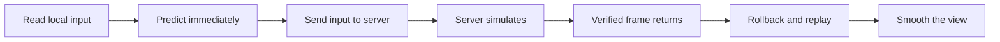

# PurrDiction

PurrDiction is PurrNet's client-side prediction addon. It lets the controlling client simulate input immediately while the server runs the authoritative simulation. When a verified server frame arrives, the client restores the verified state, replays newer inputs, and smooths any visible correction.



Use PurrDiction for gameplay where waiting for a round trip would feel bad: player movement, vehicles, projectiles, physics interactions, combat state, or other tick-based systems.

## The mental model

Every predicted object has two layers:

* **Simulation** runs at the network tick rate. Inputs and state are saved so PurrDiction can roll back and replay them.
* **View** runs once per rendered frame. It turns corrected simulation state into smooth visuals without changing gameplay.

The server remains authoritative. Clients send input, not trusted gameplay state.

## Start here

1. [Install and configure PurrDiction](installation.md).
2. Read the [architecture overview](overview.md).
3. Choose a [prediction policy](prediction-policies.md) for each kind of object.
4. Implement a [Predicted Identity](predicted-identities.md), or begin with a [built-in component](built-in-components/README.md).
5. Review [input handling](input-handling.md), [state handling](state-handling.md), and the [execution flow](flow.md) before building more complex interactions.


Prediction can hide latency; it cannot remove server authority or make nondeterministic gameplay safe. Code that affects gameplay must be replay-safe, and one-shot presentation effects must not fire again during catch-up or rollback.

