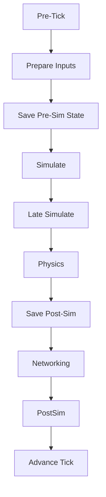
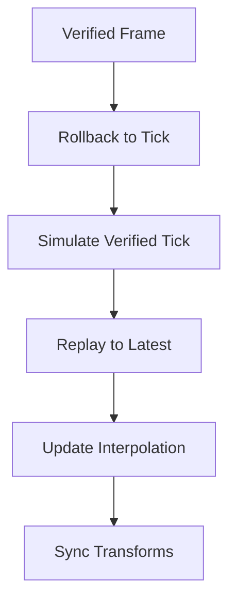
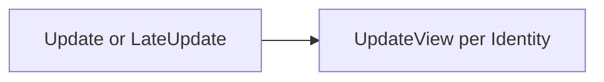

# Execution Flow

This page clarifies when each override runs and how a tick proceeds from input → simulation → physics → networking → view.

***

**At a Glance**

```mermaid
flowchart TD
  A[Pre-Tick] --> B[Prepare Inputs]
  B --> C[Save Pre-Sim State]
  C --> D[Simulate]
  D --> E[Late Simulate]
  E --> F[Physics]
  F --> G[Save Post-Sim]
  G --> H[Networking]
  H --> I[PostSim]
  I --> J[Advance Tick]
```

Client reconciliation (when a verified frame arrives):

```mermaid
flowchart TD
  K[Verified Frame] --> L[Rollback to Tick]
  L --> M[Simulate Verified Tick]
  M --> N[Replay to Latest]
  N --> O[Update Interpolation]
  O --> P[Sync Transforms]
```

Per-frame view update (client):

```mermaid
flowchart LR
  Q[Update or LateUpdate] --> R[UpdateView per Identity]
```

***

**Startup & Registration**

* `PredictionManager.Awake`
  * Registers instance per scene, sets Unity physics to script mode per provider, initializes pooling.
* `OnEarlySpawn`
  * Registers built‑in systems (Hierarchy, Players, Physics2D/3D, Time).
  * Registers scene `PredictedIdentity` components and assigns IDs/owners.
* `PredictedIdentity.Setup`
  * Called per identity with `NetworkManager`, `PredictionManager`, component ID, and owner.
  * On first spawn, calls `LateAwake()` once.

***

**Per‑Tick (OnPreTick)**

Order (server and client):

1. Mark simulation context

* `isSimulating = true`; on server, `isVerified = true`.

2. Input preparation

* Server: consumes each client's input stamped for the current tick. Clients resend recent input ticks until the server acknowledges them, so a lost input packet is recovered by the next one.
* For each identity: `PrepareInput(isServer, isController, localTick, extrapolate)`
  * On local controller: calls your `GetFinalInput`, `SanitizeInput`, writes to history.
  * On server for remotes: consumes `QueueInput` or optionally extrapolates.

3. Save pre‑simulation state

* `SaveStateInHistory(localTick)` for non‑event identities.
* Server: write initial frame payloads for state and inputs.

4. Simulation passes

* `SimulateTick(localTick, delta)` → your `Simulate(...)` implementation.
* `LateSimulateTick(delta)` → your `LateSimulate(...)` implementation.
* `DoPhysicsPass()` integrates Unity physics for the tick.

5. Save post‑simulation state

* `SaveStateInHistory(localTick)` for event‑handler identities.
* Server: write event streams and send frames to clients.

6. Post‑simulate & finish

* `PostSimulate()` per identity for any finalization.
* Finalize input/state per role (server vs client).
* Advance `localTick`.
* `isSimulating = false`.

***

**Reconciliation (OnPostTick on client)**

Client tick labels are server ticks. The client simulates a few ticks ahead of the last verified server tick, stamps its inputs with the server ticks it predicts they will execute at, and every server frame is addressed by the tick it verifies.

* Frames arrive over unreliable delivery. Frames at or below the verified tick are stale and get discarded.
* Fire `onStartingToRollback`.
* For each newer frame:
  * Full frames (join, resync) load the complete world at their server tick.
  * Delta frames decode against a baseline tick both sides already verified. If earlier frames were lost, the gap ticks are first re-simulated with the real inputs carried in the frame, so a lost frame costs replay work instead of a retransmission round trip.
  * The verified tick is simulated, its result is saved to history, and the verified tick advances.
* If the client's lead over the server drifts out of range, the manager re-centers the local tick. Corrections only move the tick forward or briefly pause it; the timeline never rewinds.
* Mark `isVerified = false`, then replay from the first unverified tick to the latest local tick.
* `SyncTransforms()` and `UpdateInterpolation(accumulateError: true)` to smooth visual corrections.
* Fire `onRollbackFinished`.

Prediction policies alter which parts of this path run for an identity:

* `FullPrediction` restores and replays normally.
* `ServerRelay` skips speculative client simulation and runs verified ticks only.
* `SoftCorrection` does not restore the live identity. It compares the verified state with client history, freezes physics while other systems replay, and consumes the resulting correction during later live ticks.
* `PredictedIfOwned` resolves to full prediction or server relay for the current client before applying these rules.

The server ignores these client timeline differences and simulates every identity. See [Prediction Policies](prediction-policies.md).

View updates are not part of tick callbacks; see below.

***

**View Update (Client)**

* `PredictionManager.Update` or `LateUpdate` (based on `UpdateViewMode`):
  * For each identity: `UpdateView(Time.unscaledDeltaTime)`
  * Identities compute/advance `viewState` and render visuals.
* Ownership changes trigger `OnViewOwnerChanged(old, new)` inside `UpdateView`.

***

**Override Cheat‑Sheet**

* Spawning/Pooling
  * `OnPreSetup()` — before `Setup` on server‑side systems.
  * `LateAwake()` — once on fresh spawn; view‑only setup.
  * `ResetState()` — clear owner/IDs and interpolation; called when reusing pooled instances.
  * `Destroyed()` — cleanup on despawn/unregister.
* Input (on `PredictedIdentity<INPUT, STATE>`)
  * `GetFinalInput(ref INPUT)` — per tick, returns current frame input for the controller.
  * `UpdateInput(ref INPUT)` — per Unity frame; cache edge‑triggered inputs.
  * `SanitizeInput(ref INPUT)` — clamp/normalize before simulation.
  * `ModifyExtrapolatedInput(ref INPUT)` — strip non‑continuous inputs during remote extrapolation.
* Simulation
  * `SimulationStart()` — before first `Simulate` for this identity.
  * `Simulate(...)` — deterministic tick logic; mutate only `STATE`.
  * `LateSimulate(...)` — optional second pass each tick.
  * `PostSimulate()` — finalize per tick.
* State ↔ Unity
  * `GetUnityState(ref STATE)` — read Unity → state when needed.
  * `SetUnityState(STATE)` — apply rollback state → Unity.
* Reconciliation / History
  * `SaveStateInHistory(tick)` — invoked by manager before/after simulation.
  * `Rollback(tick)` — restore snapshot and apply to Unity.
  * `ClearFuture(tick)` — drop states beyond a given tick.
  * `GetLatestUnityState()` — manager asks identities to resync after replays.
* View & Interpolation
  * `UpdateRollbackInterpolationState(delta, accumulateError)` — accumulate/compute view corrections.
  * `ResetInterpolation()` — clear smoothing (e.g., teleports).
  * `UpdateView(STATE viewState, STATE? verified)` — render visuals.
  * `OnViewOwnerChanged(old, new)` — view‑only ownership transitions.

## One-shot side effects during catch-up

`isVerified` can also be true while PurrDiction re-runs an already verified tick to rebuild state. Deterministic state mutation must still execute, but audio, VFX, UI notifications, achievements, and similar one-shot reactions should not.

Use `predictionManager.isVerifiedView` when a side effect should run only on the first verified delivery, or use `PredictedEvent` to apply the appropriate owner/server/verified filtering automatically. `predictionManager.isCatchingUpFrames` exposes the underlying catch-up state for advanced cases.
