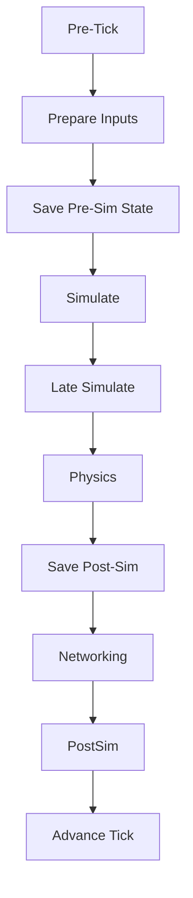
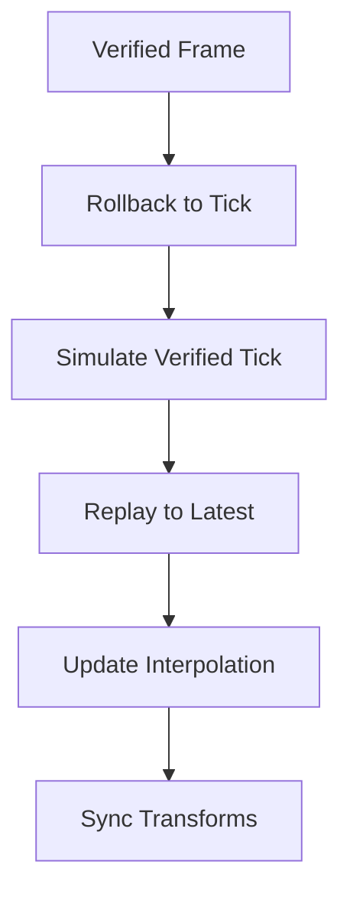
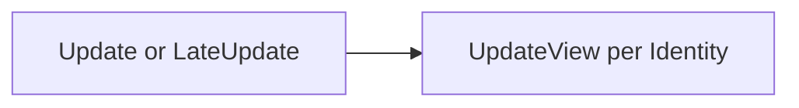

# Execution Flow

This page clarifies when each override runs and how a tick proceeds from input → simulation → physics → networking → view.

***

**At a Glance**

Client reconciliation (when a verified frame arrives):

Per-frame view update (client):

***

**Startup & Registration**

* `PredictionManager.Awake`
  * Registers instance per scene, sets Unity physics to script mode per provider, initializes pooling.
* `OnEarlySpawn`
  * Registers built‑in systems (Hierarchy, Players, Physics2D/3D, Time).
  * Registers scene `PredictedIdentity` components and assigns IDs/owners.
* `PredictedIdentity.Setup`
  * Called per identity with `NetworkManager`, `PredictionManager`, component ID, and owner.
  * On first spawn, calls `LateAwake()` once.

***

**Per‑Tick (OnPreTick)**

Order (server and client):

1. Mark simulation context

* `isSimulating = true`; on server, `isVerified = true`.

2. Input preparation

* Server: dequeues pending client input frames.
* For each identity: `PrepareInput(isServer, isController, localTick, extrapolate)`
  * On local controller: calls your `GetFinalInput`, `SanitizeInput`, writes to history.
  * On server for remotes: consumes `QueueInput` or optionally extrapolates.

3. Save pre‑simulation state

* `SaveStateInHistory(localTick)` for non‑event identities.
* Server: write initial frame payloads for state and inputs.

4. Simulation passes

* `SimulateTick(localTick, delta)` → your `Simulate(...)` implementation.
* `LateSimulateTick(delta)` → your `LateSimulate(...)` implementation.
* `DoPhysicsPass()` integrates Unity physics for the tick.

5. Save post‑simulation state

* `SaveStateInHistory(localTick)` for event‑handler identities.
* Server: write event streams and send frames to clients.

6. Post‑simulate & finish

* `PostSimulate()` per identity for any finalization.
* Finalize input/state per role (server vs client).
* Advance `localTick`.
* `isSimulating = false`.

***

**Reconciliation (OnPostTick on client)**

* Receive verified server frames and compute a target tick to reconcile to.
* Fire `onStartingToRollback`.
* Perform one of:
  * In‑place: `RollbackToFrame(tick)` → `SimulateFrameInPlace(tick)` → `SimulateFrame(tick, save=true)`
  * From previous frame: `RollbackToFrame(frame, stateTick, inputTick)` → `SimulateFrame(verifiedTick, save=true)`
* Mark `isVerified = false`, then replay to the latest local tick: `ReplayToLatestTick(lastVerified + 1)`.
* `SyncTransforms()` and `UpdateInterpolation(accumulateError: true)` to smooth visual corrections.
* Fire `onRollbackFinished`.

View updates are not part of tick callbacks; see below.

***

**View Update (Client)**

* `PredictionManager.Update` or `LateUpdate` (based on `UpdateViewMode`):
  * For each identity: `UpdateView(Time.unscaledDeltaTime)`
  * Identities compute/advance `viewState` and render visuals.
* Ownership changes trigger `OnViewOwnerChanged(old, new)` inside `UpdateView`.

***

**Override Cheat‑Sheet**

* Spawning/Pooling
  * `OnPreSetup()` — before `Setup` on server‑side systems.
  * `LateAwake()` — once on fresh spawn; view‑only setup.
  * `ResetState()` — clear owner/IDs and interpolation; called when reusing pooled instances.
  * `Destroyed()` — cleanup on despawn/unregister.
* Input (on `PredictedIdentity<INPUT, STATE>`)
  * `GetFinalInput(ref INPUT)` — per tick, returns current frame input for the controller.
  * `UpdateInput(ref INPUT)` — per Unity frame; cache edge‑triggered inputs.
  * `SanitizeInput(ref INPUT)` — clamp/normalize before simulation.
  * `ModifyExtrapolatedInput(ref INPUT)` — strip non‑continuous inputs during remote extrapolation.
* Simulation
  * `SimulationStart()` — before first `Simulate` for this identity.
  * `Simulate(...)` — deterministic tick logic; mutate only `STATE`.
  * `LateSimulate(...)` — optional second pass each tick.
  * `PostSimulate()` — finalize per tick.
* State ↔ Unity
  * `GetUnityState(ref STATE)` — read Unity → state when needed.
  * `SetUnityState(STATE)` — apply rollback state → Unity.
* Reconciliation / History
  * `SaveStateInHistory(tick)` — invoked by manager before/after simulation.
  * `Rollback(tick)` — restore snapshot and apply to Unity.
  * `ClearFuture(tick)` — drop states beyond a given tick.
  * `GetLatestUnityState()` — manager asks identities to resync after replays.
* View & Interpolation
  * `UpdateRollbackInterpolationState(delta, accumulateError)` — accumulate/compute view corrections.
  * `ResetInterpolation()` — clear smoothing (e.g., teleports).
  * `UpdateView(STATE viewState, STATE? verified)` — render visuals.
  * `OnViewOwnerChanged(old, new)` — view‑only ownership transitions.
