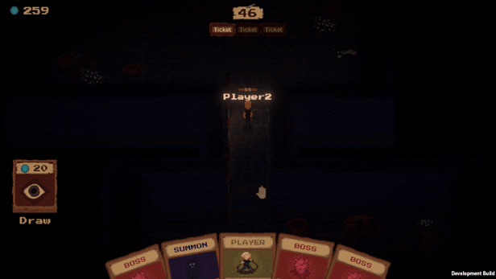

# 👿 Cirque de Slay

[Check it out on Steam](https://store.steampowered.com/app/3595740/Cirque_de_Slay/)

Cirque de Slay is a competitive online action-roguelike for up to four players, set in a twisted carnival. Build decks, play cards, and twist the rules to challenge your opponents as they scavenge for loot, evade traps, and hunt down the boss to escape… choose your friends wisely.

<figure><figcaption></figcaption></figure>

Each round, players take turns exploring this twisted circus, looting gear, avoiding traps, and racing to find the boss. But while one player explores, the others spectate... and interfere.

Spectators play sinister cards that alter the active player’s run in real time, spawning enemies, closing doors, flipping traps, or stealing their loot. No run is ever safe… and no victory is ever guaranteed.

<figure><figcaption></figcaption></figure>
