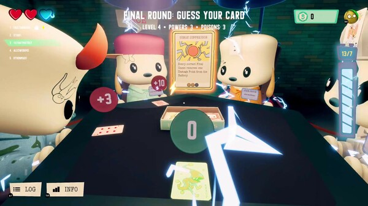

# 🤯 Five Heads



[Check it out on Steam](https://store.steampowered.com/app/3370840/Five_Heads/)

Five prisoners each have a visible-to-others card on their forehead. Across three rounds, they logically deduce and rank their cards from lowest to highest. On the final round, each guesses their exact card, using every prior guess as a clue. A single mistake can doom them—can you solve it?

<figure><figcaption></figcaption></figure>
