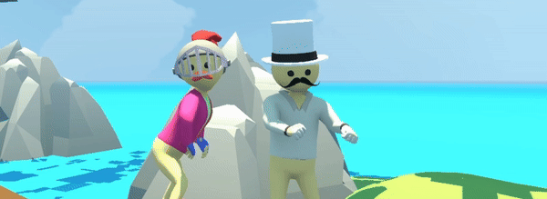

# 👖 Pantless

[Check it out on Steam](https://store.steampowered.com/app/2952930/Pantless/)

Pantless brings a hilarious twist to the rage-inducing game genre inspired by Getting Over It with Bennett Foddy. In this third-person, physics-based game, players control customizable characters hilariously devoid of pants, navigating through chaotic and fun challenges.

<figure><figcaption></figcaption></figure>

Inspired by the likes of Getting Over It with Bennett Foddy, this game challenges players to navigate through increasingly absurd and challenging terrains—all while hilariously lacking trousers. Whether you're flailing up a hill or tumbling towards a new obstacle, prepare for uncontrollable laughter and shouting.

<figure><figcaption></figcaption></figure>
