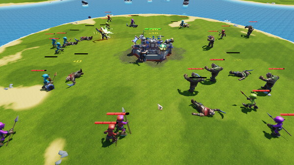

# 🏰 Tower Arena Survive

[Check it out on Steam](https://store.steampowered.com/app/3348510/Tower_Arena_Survive/)

Tower Arena Survive (TAS) is a dynamic mix of roguelike and tower defense, where your castle becomes an impregnable fortress. Use 80+ weapons and 88 upgrades to balance income, damage, and defense against up to 7 foes. Buy monsters to disrupt enemy waves and change the tide of battle!

<figure><figcaption></figcaption></figure>

* **Endless Replayability:** Infinite tactical combinations ensure no two matches are ever the same.
* **Innovative Mechanics:** Use over 80 weapons and 88 upgrades while deploying special monster waves to keep your adversaries on their toes.
* **Thrilling Multiplayer:** Engage in epic battles against up to 7 players and prove your strategic supremacy.
* **Fair Play:** Success is determined solely by your skill and tactics—no pay-to-win advantages.

Step into the world of Tower Arena Survive and let your strategic brilliance shine as you build an unbreakable fortress and outsmart every challenger on the battlefield!
