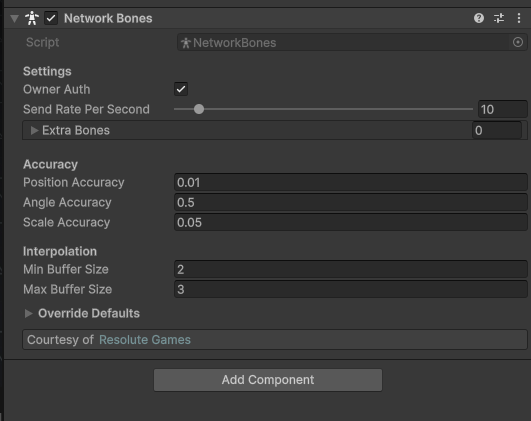

# Network Bones

This component syncs the individual bones of a skinned mesh across the network. Add it to a GameObject with a `SkinnedMeshRenderer` (it scans the children too) and it replicates the local position, rotation and scale of every bone in the skeleton.

It's meant for movement that isn't driven by an Animator: ragdolls, procedural animation, IK, jiggle and cloth bones, or anything that pushes the rig around directly. The [Network Animator](network-animator.md) syncs Animator parameters and lets each machine play the animation itself, while Network Bones syncs the resulting transforms, so the two solve different problems. Reach for this when the bones move from something other than a shared animation.


This component was contributed by [Resolute Games](https://resolutegames.com/).


### Which bones get synced

On spawn, the component collects every bone referenced by the `SkinnedMeshRenderer` components in the hierarchy and removes duplicates. Anything you drop into **Extra Bones** is added on top, so you can sync bones that no renderer points at, like an IK target, a weapon mount, or a bone you drive by hand.

The bone list, send rate and accuracy fields are locked once the object spawns (marked with `PurrLock` in the inspector) and can't be changed at runtime.

<figure><figcaption>
The Network Bones component with its default values
</figcaption></figure>

### Settings

| Setting | Effect |
| --- | --- |
| Owner Auth | Decides who drives the skeleton. If true, the owning client is in control (Client Auth); with no owner the server takes over. If false, only the server drives it (Server Auth). Default: true. |
| Send Rate Per Second | How many times per second the controller sends bone updates. Higher is smoother but costs more bandwidth. Range 1–128, default 10. |
| Extra Bones | Bones to sync on top of the ones found on the skinned mesh renderers. |
| Position Accuracy | The step (in meters) positions are rounded to before sending. Smaller is more precise, larger sends fewer bytes. Default: 0.01. |
| Angle Accuracy | The step (in degrees) rotations are rounded to. Default: 0.5. |
| Scale Accuracy | The step bone scale is rounded to. Default: 0.05. |
| Min / Max Buffer Size | How many snapshots the receiver holds before interpolating. A small backlog lets it play through network jitter smoothly. Defaults: 2 and 3. |

### How it works

* **Quantization:** each bone's local position, rotation (as euler angles) and scale is rounded to the accuracy you set and sent as integers rather than raw floats. Coarser accuracy means smaller packets.
* **Delta packing:** updates go through the `DeltaModule`, so a bone that hasn't moved since the last send writes nothing. A skeleton standing still costs almost no bandwidth, and only the bones that actually changed are on the wire.
* **Interpolation:** the receiver buffers incoming snapshots and interpolates positions and scale linearly and rotation with slerp, smoothing the gaps between updates.
* **MTU batching:** bone data is split across as many RPCs as it takes to stay under the connection's MTU, so a heavy skeleton with hundreds of bones syncs without oversized packets. Updates use the Unreliable channel, so a dropped packet is just replaced by the next tick's latest values.

### Authority

Network Bones uses the standard owner/server authority model:

* **Owner Auth (default):** the owning client drives the skeleton and sends to the server, which relays it to the other observers. With no owner, the server drives it.
* **Server Auth:** only the server drives the skeleton, and client-sent bone updates are rejected.

The controller sends to every observer except itself, and except the owner while the owner is the one driving, so a machine never re-applies its own bones on top of itself.
