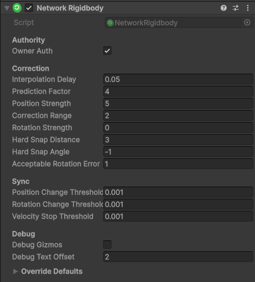

# Network Rigidbody

This component allows you to very easily utilize the Rigidbody over the network. It helps sync the actual forces of the Rigidbody, and utilizes physics to smoothly align it across the network.


If you need physics in multiplayer, you might want to read the [Physics In Multiplayer](../guides/physics-in-multiplayer.md) page




### Settings

<figure><figcaption></figcaption></figure>

<table><thead><tr><th width="210">Setting</th><th>Effect</th></tr></thead><tbody><tr><td>Owner Auth</td><td>Decides who holds the truth of the simulation. Server or Owner</td></tr><tr><td>Acceptable Error</td><td>How far from the actual position is it allowed to be to stop correcting</td></tr><tr><td>Hard Correction Threshold</td><td>How far from the actual position is it allowed to be, before teleporting</td></tr><tr><td>Max Correction Time</td><td>For how long can it stay outside of acceptable error before teleporting (-1 for infinity)</td></tr><tr><td>Spring Constant</td><td>The stiffness of the force pulling the object towards the target position</td></tr><tr><td>Damping Constant</td><td>The resistance applied to smooth out the movement and match the target's velocity. Helps prevent oscillation.</td></tr><tr><td>Low Speed Threshold</td><td>Speed under which we relax the spring to prevent jitter while moving slowly.</td></tr><tr><td>Low Speed Spring Multiplier</td><td>How much to weaken the spring at low speeds (0.1 = 10% strength)</td></tr><tr><td>Extrapolate Based On Ping</td><td>Whether the target position should extrapolate based on local ping</td></tr><tr><td>Max Forces Per Tick</td><td>Limit on how many specific force events (like AddForce/Explosions) can be synced in a single frame to prevent flooding</td></tr><tr><td>Thresholds</td><td>Minimum movement required to trigger a network update</td></tr></tbody></table>
