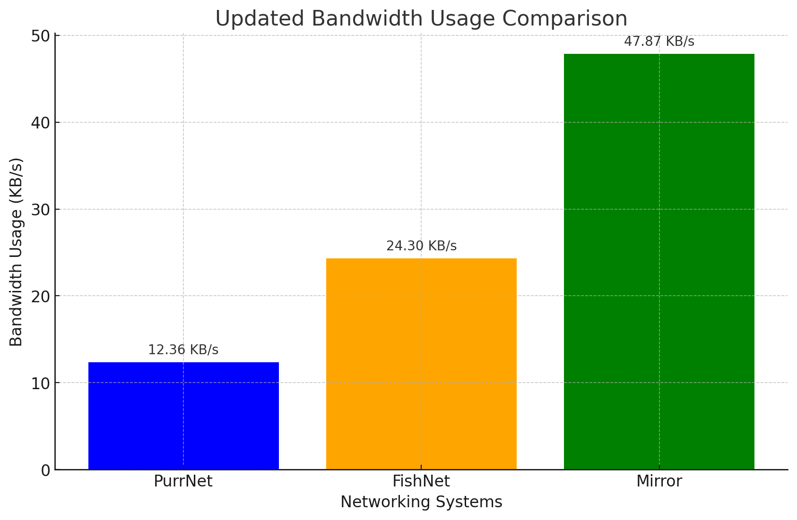

# 🏎️ Performance


PurrNet has yet to do any active performance optimizations. All results seen below are prior to any attempts and bettering performance, and it should only improve for future updates.


Tests are benchmarked using the [NetLimiter](https://www.netlimiter.com/) tool, as a neutral third party, to monitor process bandwidth for both download and upload rates. We also ensured that the Unity Editors (which this was tested within) was at 0 download and 0 upload before beginning any tests.

Tests are setup with 1 editor as a server and 1 editor as a client (made with ParrelSync). The stats shown are data accumulative for both Unity Editors.

All tests were performed in the exact same project.

Tests carried out with the following occurring every tick at a tick-rate (send rate) of 20\
\- Sending 100 RPC’s to every client, both with and without parameters (with randomized values).

## Results & Conclusion


Mind that this only covers RPC benchmarks for now. See the [Why RPC Tests](performance.md#why-rpc-tests) section for more on that.


* PurrNet vs. FishNet: \~49.15% lower usage.
* PurrNet vs. Mirror: \~74.18% lower usage.
* FishNet vs. Mirror: \~49.23% lower usage.

<figure><figcaption></figcaption></figure>

## Average usage

This is the average across 3 RPC tests with different data parameters. See the [Raw Data results](performance.md#raw-results) for more information on each.

| System  | Download    | Upload      |
| ------- | ----------- | ----------- |
| PurrNet | 12.357 KB/s | 12.357 KB/s |
| FishNet | 24.303 KB/s | 24.303 KB/s |
| Mirror  | 47.867 KB/s | 47.867 KB/s |

## Why RPC Tests?

We will do more benchmark testing in the future, however. We found RPC's to be the core functionality of every networking system, and a good common denominator to test. Different networking systems build various components for various cases, so testing specific components will easily lead to faulty points of comparisons.

## Raw results

Keep in mind that every data-point was fluctuating with \~0.2 KB/s. The picture was taken when seen around the mid-point of fluctuation, but this leaves margin for small inaccuracy in comparison.

Download and Upload speed is the same, because both editors are represented. The server & the client. These numbers would differ if there was some faulty overhead on either side.

### PurrNet 1.5.0

Vector3 + Quaternion + bool\
.png>)

Vector3\
.png>)

RPC Only:\
.png>)\

### FishNet 4.5.6R Pro

Vector3 + Quaternion + bool\
.png>)

Vector3\
.png>)

RPC Only:\
.png>)

### Mirror 93.0.1

Vector3 + Quaternion + bool\
.png>)

Vector3\
.png>)

RPC Only:\
.png>)
