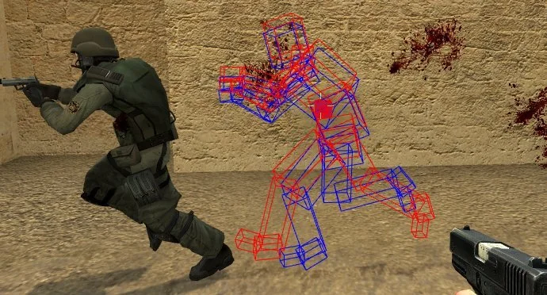

# Client Side Prediction




Prediction is currently in [**Early Access**](../../terminology/early-access.md)**,** meaning that only paid support members in the Discord has access to it. This will become available for free in the future!


Client-side prediction is a technique used particularly in games to provide a local, responsive experience in a multiplayer environment. It involves predicting future game states on the client side based on user inputs, allowing the game to feel instant and reactive.

For example, if you are controlling a character and keep moving right, the client can predict that you will continue moving right and display this movement immediately. This way, when you interact with other players, both see a consistent outcome.

Of course, predictions can sometimes be incorrect. When this happens, the client needs to apply corrections. This involves adjusting the game state to match the server's authoritative state, ensuring that everything remains consistent and accurate.

Don't worry if this sounds a bit confusing at first—this overview is meant to set the stage and help you understand the design decisions and limitations involved in client-side prediction.

<figure><figcaption></figcaption></figure>
