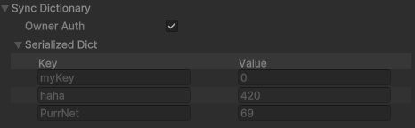

# SyncDictionary

Synchronized Dictionary, or most commonly referred as "SyncDictionary" are easily definable in your code, and will handle automatically align a dictionary between all [players](../../playerid-client-connection.md).&#x20;

In theory, you could just convert a dictionary to a SyncDictionary, and it should work. Working with it is the exact same with adding, setting, removing or clearing.

SyncDictionaries are built with the Network Module setup, meaning that you have to initialize it. Below is a usage example:

```csharp
//Creates a new instance of the dictionary - `true` means it is owner auth. 
[SerializeField] private SyncDictionary<int, float> myDictionary = new(true);

protected override void OnSpawned()
{
    //Subscribing to changes made to the dictionary
    myDictionary.onChanged += OnDictionaryChanged;
}

private void OnDictionaryChanged(SyncDictionaryChange<int, float> change)
{
    //This is called for everyone when the dictionary changes.
    //It will log out the Key, Value and operation
    Debug.Log($"Dictionary updated: {change}");
}

private void ChangeMyDictionary()
{
    //This will change or add a value to the dictionary
    myDictionary[123] = 0.69f;
    
    //This will remove the value from the dictionary
    myDictionary.Remove(123);
    
    //This will clear the dictionary
    myDictionary.Clear();
    
    //This will mark the key as dirty
    myDictionary.SetDirty(123);
}
```

The SyncDictionary is custom serialized in editor, in order to make visual debugging easier.

<figure><figcaption></figcaption></figure>
