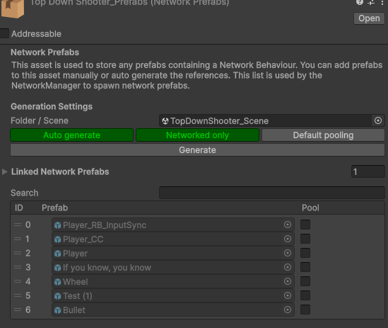
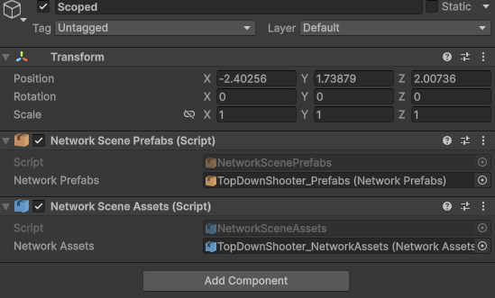

# Scene Scoped Prefabs & Assets

The [Network Prefabs](network-prefabs.md) and [Network Assets](network-assets.md) on your Network Manager are global. They load with the manager and stay in memory for as long as the game runs, even the entries only one level ever uses. For a small game that is fine. For a game with many scenes and a lot of unique content per scene, it means paying the memory cost of everything, everywhere, all the time.

Scene scoped registries let a scene bring its own prefabs and assets along. They register when the scene loads, they are used exactly like the global ones while the scene is open, and they go away with the scene when it unloads, prefabs and all.

## Setting it up

1. Create a Network Prefabs and/or a Network Assets scriptable for the scene, the same way you would for the global ones.
2. Set its **Folder / Scene** field to the scene itself. The registry then pulls everything that scene references instead of scanning a folder, and it regenerates whenever you save the scene. The list mirrors the scene, so anything the scene stops referencing is removed on the next generate.
3. In the scene, add an empty GameObject and put a `NetworkScenePrefabs` component on it. Drag the scene's Network Prefabs into it. Do the same with `NetworkSceneAssets` for the Network Assets.

<figure><figcaption><p>A Network Prefabs registry generating from a scene instead of a folder</p></figcaption></figure>

<figure><figcaption><p>Both registry components on one object in the scene</p></figcaption></figure>

That is the whole setup. Both components are plain MonoBehaviours, so the scriptable is referenced by the scene and by nothing else.


Keep prefabs that belong to a scene out of the global registry. If the global Network Prefabs auto generates from a folder that also contains them, they end up global and the global entry always wins. Point the global registry at a folder that only holds the prefabs every scene needs, or leave the global slot empty if you have none.


You can have more than one registry component in a scene, and a scene registry can link other registries the same way the global one can. Every peer loads the same scene file, so the tables come out identical on all of them without any extra ordering work.

## How it resolves

When you `Instantiate` a prefab, PurrNet looks for it in this order:

1. The global registry on the Network Manager.
2. The registry of the scene the instance is created in.
3. Any other loaded scene that has it. This logs a warning once, because peers that do not have that scene loaded will not be able to spawn the object.

The id that goes over the network carries the scene it belongs to, so the receiving peer resolves it through that scene's registry. Scenes are synced before spawns arrive, so a client always has the registry it needs by the time it needs it.

Because the scene of the instance decides the scope, instantiate the object into the scene it belongs to, for example by parenting it under something in that scene. An object spawned into a different scene still resolves through the fallback, but it is the warning case above.

Assets work the same way. When an asset from a scene registry is sent in an RPC or a sync var, it is looked up in the global registry first and then in the loaded scenes. On the receiving side it resolves through the scene named in the id, so an asset that only lives in a scene registry is only valid while that scene is loaded. Referencing one from an object that outlives the scene, such as something under `DontDestroyOnLoad`, gives you a null on peers that have unloaded it.

## Lifetime and memory

Scene scoped prefabs are pooled per scene. A prefab marked as pooled in a scene registry warms up into a pool that lives inside that scene, and despawned instances go back into that pool rather than the global one. The pool, its idle instances, and the cached prefab layouts are all discarded when the scene unloads.

After the unload nothing in PurrNet references the scriptable or the prefabs in it. Unity's unused asset cleanup, which runs on scene loads or when you call `Resources.UnloadUnusedAssets` yourself, frees them like any other scene content. Loading the scene again gives it a fresh scene id, new registrations, and a fresh pool, so nothing stale carries over.

The [Pooling](../network-identity/pooling.md) settings on the registry entries work the same as for global prefabs.

## Reading the scope in code

You rarely need to touch this, but the scope is visible if you do. A Network Identity exposes `scopedPrefabId`, which includes the scene when the prefab came from a scene registry. The inspector shows it as `index@scene`.

```csharp
var id = identity.scopedPrefabId;

if (id.isSceneScoped)
    Debug.Log($"Prefab {id.value} from scene {id.scope.Value}");
```

The resolvers on the Network Manager accept a scene hint when you want to resolve a prefab reference for a specific scene:

```csharp
var resolver = networkManager.prefabResolver;

if (resolver.TryGetPrefabData(prefab, sceneId, out var data))
    Debug.Log($"Resolved as {data.prefabId}");
```

`networkManager.networkAssetResolver` offers the same for assets through `TryGetId` and `TryGetAsset`.
