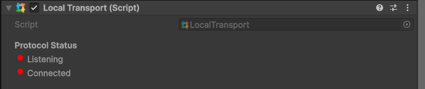

# Local Transport

The local transport mimics how the Network acts, but never actually sends any data. This is great if you want your game to work in single player still using networking code and components, but doesn't require you to start a server or client.

The player will still act as a [host](../../../terminology/host.md).

<figure><figcaption>
Example of local transport component
</figcaption></figure>
