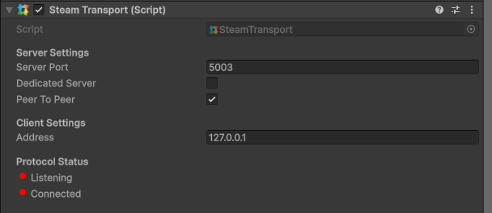

# Steam Transport

The Steam Transport comes with PurrNet by default, but requires at a minimum the Steamworks.Net package in order to work.

[Read the comprehensive guide by Judsin here.](../../guides/steam-setup/connect-with-steam.md)

### Parameters

* Server Port - The port to connect through
* Dedicated server - Whether you're connecting as/to a [Steam Game Server](https://partner.steamgames.com/doc/features/multiplayer/game_servers)
* Peer To Peer - Whether you want clients connecting directly using P2P
* Address - The address to connect to. In case of P2P, this is the CSteamID

### Steam isn't networking!

It's highly important that devs understand that networking isn't Steam and Steam isn't networking. A Steam "Lobby" isn't network related either. Purely a way for Steam users to share meta data through Steam (usernames, Steam ID, chat, etc.)

<figure><figcaption>
Example of steam transport component
</figcaption></figure>
