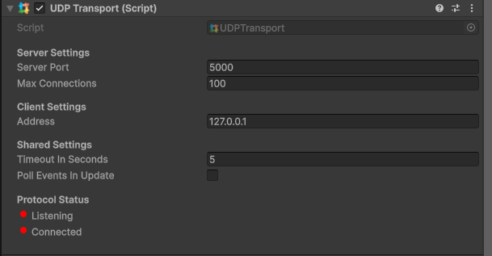

# UDP Transport

The UDP transport is the most commonly used transport layer for multiplayer. It allows you to easily connect to any public IP with a given port.\
\
We're utilizing the [LiteNetLib](https://github.com/RevenantX/LiteNetLib) MIT licensed project to support reliable and unreliable messages.

### Parameters

* Server Port - The port which the server will start on, and clients connect to
* Max Connections - The max amount of client connections allowed
* Address - This is the IP of the server. Default is the local host

<figure><figcaption>
Example of UDP transport component
</figcaption></figure>
