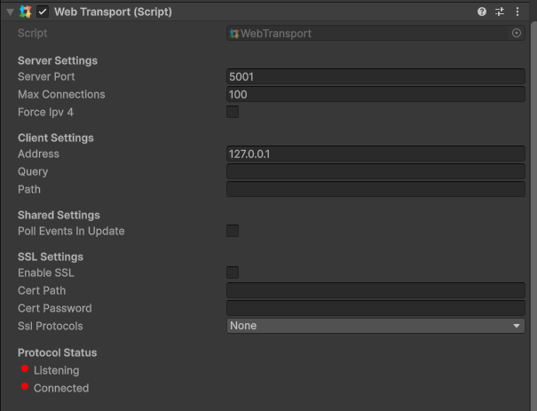

# Web Transport

The web transport handles connections through web, which is handled differently and doesn't work with the UDP transport.

### Parameters

* Server Port - The port which the server will start on, and clients connect to
* Max Connections - The max amount of client connections allowed
* Address - This is the IP of the server. Default is the local host
* Query - Used to specify custom URL query
* Path - Used to specify custom URL path
* Enable SSL - Whether to utilize SSL
* Cert Path - Path of the SSL Certificate
* Cert Password - The password of the SSL
* Ssl Protocols - The protocol for the SSL

<figure><figcaption>
Example of web transport component
</figcaption></figure>
